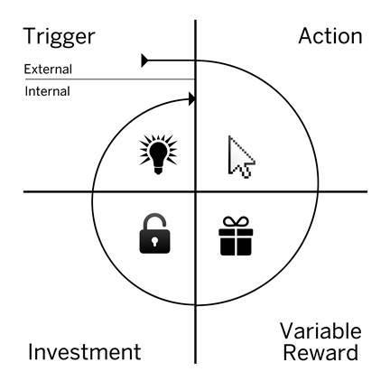

# Introduction

INTRODUCTION

 

79 percent of smartphone owners check their device within 15 minutes of waking up every morning.[[i]](../Text/index_split_024.html#filepos349116) Perhaps more startling, fully one-third of Americans say they would rather give up sex than lose their cell phones.[[ii]](../Text/index_split_024.html#filepos349370)

A 2011 university study suggested people check their phones 34 times per day.[[iii]](../Text/index_split_024.html#filepos349637) However, industry insiders believe that number is closer to an astounding 150 daily sessions.[[iv]](../Text/index_split_024.html#filepos349920)

Face it, we’re hooked.

The technologies we use have turned into compulsions, if not full-fledged addictions. It’s the impulse to check a message notification. It’s the pull to visit YouTube, Facebook, or Twitter for just a few minutes, only to find yourself still tapping and scrolling an hour later. It’s the urge you likely feel throughout your day but hardly notice.

Cognitive psychologists define habits as, “automatic behaviors triggered by situational cues:” things we do with little or no conscious thought.[[v]](../Text/index_split_024.html#filepos350274) The products and services we use habitually alter our everyday behavior, just as their designers intended.[[vi]](../Text/index_split_024.html#filepos350465) Our actions have been engineered.

How do companies, producing little more than bits of code displayed on a screen, seemingly control users’ minds? What makes some products so habit-forming?

For many products, forming habits is an imperative for survival. As infinite distractions compete for our attention, companies are learning to master novel tactics to stay relevant in users’ minds. Today, amassing millions of users is no longer good enough. Companies increasingly find that their economic value is a function of the strength of the habits they create. In order to win the loyalty of their users and create a product that’s regularly used, companies must learn not only what compels users to click, but also what makes them tick.

Although some companies are just waking up to this new reality, others are already cashing in. By mastering habit-forming product design, the companies profiled in this book make their goods indispensable.

First-To-Mind Wins

Companies who form strong user habits enjoy several benefits to their bottom line. These companies attach their product to “internal triggers.” As a result, users show up without any external prompting.

Instead of relying on expensive marketing, habit-forming companies link their services to the users’ daily routines and emotions.[[vii]](../Text/index_split_024.html#filepos351162) A habit is at work when users feel a tad bored and instantly open Twitter. They feel a pang of loneliness and before rational thought occurs, they are scrolling through their Facebook feeds. A question comes to mind and before searching their brains, they query Google. The first-to-mind solution wins. In chapter one, this book explores the competitive advantages of habit-forming products.

How do products create habits? The answer: They manufacture them. While fans of the television show Mad Men are familiar with how the ad industry once created consumer desire during Madison Avenue’s golden era, those days are long gone. A multi-screen world of ad-wary consumers has rendered Don Draper’s big budget brainwashing useless to all but the biggest brands.

Today, small startup teams can profoundly change behavior by guiding users through a series of experiences I call “hooks.” The more often users run through these hooks, the more likely they are to form habits.

How I Got Hooked

In 2008, I was among a team of Stanford MBAs starting a company backed by some of the brightest investors in Silicon Valley. Our mission was to build a platform for placing advertising into the booming world of online social games.

Notable companies were making billions of dollars selling virtual cows on digital farms while advertisers were spending huge sums of money to influence people to buy whatever they were peddling. I admit I didn’t get it at first and found myself standing at the water’s edge wondering, "How do they do it?"

At the intersection of these two industries dependent on mind manipulation, I embarked upon a journey to learn how products change our actions and, at times, create compulsions. How did these companies engineer user behavior? What were the moral implications of building potentially addictive products? Most importantly, could the same forces that made these experiences so compelling also be used to build products to improve people’s lives?

Where could I find the blueprints for forming habits? To my disappointment, I found no guide. Businesses skilled in behavior design guarded their secrets and although I uncovered books, white papers, and blog posts tangentially related to the topic, there was no how-to manual for building habit-forming products.

I began documenting my observations of hundreds of companies to uncover patterns in user experience designs and functionality. Although every business had its unique flavor, I sought to identify the commonalities behind the winners and understand what was missing among the losers.

I looked for insights from academia: drawing upon consumer psychology, human-computer interaction, and behavioral economics research. In 2011, I began sharing what I learned and started working as a consultant to a host of Silicon Valley companies, from small startups to Fortune 500 enterprises. Each client provided an opportunity to test my theories, draw new insights, and refine my thinking. I began blogging about what I learned at NirAndFar.com and my essays were syndicated to other sites. Soon, readers began writing in with their own observations and examples.

In the fall of 2012, Dr. Baba Shiv and I designed and taught a class at the Stanford Graduate School of Business on the science of influencing human behavior. The next year, I partnered with Dr. Steph Habif to teach a similar course at the Hasso Plattner Institute of Design.

These years of distilled research and real-world experience resulted in the creation of the Hook Model: a four-phase process companies use to forms habits. Through consecutive hook cycles, successful products reach their ultimate goal of unprompted user engagement, bringing users back repeatedly, without depending on costly advertising or aggressive messaging.

While I draw many examples from technology companies given my industry background, hooks are everywhere — in apps, sports, movies, games, and even our jobs. Hooks can be found in virtually any experience that burrows into our minds (and often our wallets). The four steps of the Hook Model provide the framework for the chapters of this book.

[*OceanofPDF.com*](https://oceanofpdf.com)

The Hook Model

1. Trigger

A trigger is the actuator of behavior — the spark plug in the engine. Triggers come in two types: external and internal.[[viii]](../Text/index_split_024.html#filepos351429) Habit-forming products start by alerting users with external triggers like an email, a website link, or the app icon on a phone.

For example, suppose Barbra, a young woman in Pennsylvania, happens to see a photo in her Facebook newsfeed taken by a family member from a rural part of the state. It’s a lovely picture and since she is planning a trip there with her brother Johnny, the external trigger’s call-to-action intrigues her and she clicks. By cycling through successive hooks, users begin to form associations with internal triggers, which attach to existing behaviors and emotions.

When users start to automatically cue their next behavior, the new habit becomes part of their everyday routine. Over time, Barbra associates Facebook with her need for social connection. Chapter two explores external and internal triggers, answering the question of how product designers determine which triggers are most effective.

2. Action

Following the trigger comes the action: the behavior done in anticipation of a reward. The simple action of clicking on the interesting picture in her newsfeed takes Barbra to a website called Pinterest, a “pinboard-style photo-sharing” site.[[ix]](../Text/index_split_024.html#filepos351616)

This phase of the hook, as described in chapter three, draws upon the art and science of usability design to reveal how products drive specific user actions. Companies leverage two basic pulleys of human behavior to increase the likelihood of an action occurring: the ease of performing an action and the psychological motivation to do it.[[x]](../Text/index_split_024.html#filepos351834)

Once Barbra completes the simple action of clicking on the photo, she is dazzled by what she sees next.

 

3. Variable Reward

What distinguishes the Hook Model from a plain vanilla feedback loop is the hook’s ability to create a craving. Feedback loops are all around us, but predictable ones don’t create desire. The unsurprising response of your fridge light turning on when you open the door doesn’t drive you to keep opening it again and again. However, add some variability to the mix — say a different treat magically appears in your fridge every time you open it — and voila, intrigue is created.

Variable rewards are one of the most powerful tools companies implement to hook users; chapter four explains them in further detail. Research shows that levels of the neurotransmitter dopamine surge when the brain is expecting a reward.[[xi]](../Text/index_split_024.html#filepos352033) Introducing variability multiplies the effect, creating a focused state, which suppresses the areas of the brain associated with judgment and reason while activating the parts associated with wanting and desire.[[xii]](../Text/index_split_024.html#filepos352261) Although classic examples include slot machines and lotteries, variable rewards are prevalent in many other habit-forming products.

When Barbra lands on Pinterest, not only does she see the image she intended to find, but she is also served a multitude of other glittering objects. The images are related to what she is generally interested in — namely things to see on her upcoming trip to rural Pennsylvania — but there are other things that catch her eye as well. The exciting juxtaposition of relevant and irrelevant, tantalizing and plain, beautiful and common, sets her brain’s dopamine system aflutter with the promise of reward. Now she’s spending more time on Pinterest, hunting for the next wonderful thing to find. Before she knows it, she’s spent 45 minutes scrolling.

Chapter four also explores why some people eventually lose their taste for certain experiences and how variability impacts their retention.

4. Investment

The last phase of the Hook Model is where the user does a bit of work. The investment phase increases the odds that the user will make another pass through the hook cycle in the future. The investment occurs when the user puts something into the product of service such as time, data, effort, social capital, or money.

However, the investment phase isn’t about users opening up their wallets and moving on with their day. Rather, the investment implies an action that improves the service for the next go-around. Inviting friends, stating preferences, building virtual assets, and learning to use new features are all investments users make to improve their experience. These commitments can be leveraged to make the trigger more engaging, the action easier, and the reward more exciting with every pass through the hook cycle. Chapter five delves into how investments encourage users to cycle through successive hooks.

As Barbra enjoys endlessly scrolling through the Pinterest cornucopia, she builds a desire to keep the things that delight her. By collecting items, she’ll be giving the site data about her preferences. Soon she will follow, pin, re-pin, and make other investments, which serve to increase her ties to the site and prime her for future loops through the hook.

 

A New Superpower

Habit-forming technology is already here, and it is being used to mold our lives. The fact that we have greater access to the web through our various connected devices — smartphones and tablets, televisions, game consoles, and wearable technology — gives companies far greater ability to affect our behavior.

As companies combine their increased connectivity to consumers, with the ability to collect, mine, and process customer data at faster speeds, we are faced with a future where everything becomes potentially more habit-forming. As famed Silicon Valley investor Paul Graham writes, "…unless the forms of technological progress that produced these things are subject to different laws than technological progress in general, the world will get more addictive in the next 40 years than it did in the last 40."[[xiii]](../Text/index_split_024.html#filepos352561) Chapter six explores this new reality and discusses the morality of manipulation.

Recently, a blog reader emailed me, “If it can’t be used for evil, it’s not a superpower.” He’s right. And under this definition, building habit-forming products is indeed a superpower. If used irresponsibly, bad habits can quickly degenerate into mindless zombie-like addictions.

Did you recognize Barbra and her brother Johnny from the previous example? Zombie film buffs likely did. They are characters from the classic horror flick Night of the Living Dead, a story about people possessed by a mysterious force, which compels their every action.[[xiv]](../Text/index_split_024.html#filepos352762)

No doubt you’ve noticed the resurgence of the zombie genre over the past several years. Games like Resident Evil, television shows like The Walking Dead, and movies including World War Z, are a testament to the creatures’ growing appeal. But why are zombies suddenly so fascinating? Perhaps technology’s unstoppable progress — ever more pervasive and persuasive — has grabbed us in a fearful malaise at the thought of being involuntarily controlled.

Although the fear is palpable, we are like the heroes in every zombie film — threatened but ultimately more powerful. I have come to learn that habit-forming products can do far more good than harm. “Choice architecture,” as described by famed scholars Thaler, Sunstein, and Balz, offers techniques to influence people’s decisions and affect behavioral outcomes. Ultimately though, the practice should be, “used to help nudge people to make better choices (as judged by themselves).”[[xv]](../Text/index_split_024.html#filepos353011) Accordingly, this book teaches innovators how to build products to help people do the things they already want to do but, for lack of a solution, don’t do.

Hooked seeks to unleash the tremendous new powers innovators and entrepreneurs have to influence the everyday lives of billions of people. I believe the trinity of access, data, and speed presents unprecedented opportunities to create positive habits. When harnessed correctly, technology can enhance lives through healthful behaviors that improve our relationships, make us smarter, and increase productivity.

The Hook Model explains the rationale behind the design of many successful habit-forming products and services we use daily. Although not exhaustive given the vast amount of academic literature available, the model is intended to be a practical tool (rather than a theoretical one) made for entrepreneurs and innovators who aim to use habits for good. In this book, I have compiled the most relevant research, shared actionable insights, and provided a practical framework designed to increase the innovator’s odds of success.

Hooks connect the user’s problem with a company’s solution frequently enough to form a habit. My goal is to provide you with a deeper understanding of how certain products change what we do, and by extension, who we are.

\*\*\*

How to Use this Book

At the end of each section, you’ll find a few bulleted takeaways. Reviewing them, jotting them down in a notebook, or sharing them on a social network is a great way to pause, reflect, and reinforce what you have read.

Building a habit-forming product yourself? If so, the “Do This Now” sections at the end of subsequent chapters will help guide your next steps.

\*\*\*

Remember and Share

- Habits are defined as behaviors done with little or no conscious thought.

- The convergence of access, data, and speed is making the world a more habit-forming place.

- Businesses that create customer habits gain a significant competitive advantage.

- The Hook Model describes an experience designed to connect the user's problem to a solution frequently enough to form a habit.

- The Hook Model has four phases: trigger, action, variable reward, and investment.[[xvi]](../Text/index_split_024.html#filepos353289)

[*OceanofPDF.com*](https://oceanofpdf.com)
