# 3. Action

3. ACTION

 

The next step in The Hook is the action phase. The trigger, driven by internal or external cues, informs the user of what to do next; however, if the user does not take action, the trigger is useless. To initiate action, doing must be easier than thinking. Remember, a habit is a behavior done with little or no conscious thought. The more effort — either physical or mental — required to perform the desired action, the less likely it is to occur.

Action vs. Inaction

If action is paramount to habit-formation, how can a product designer influence users to act? Is there a formula for behavior? It turns out there is.

While there are many theories about what drives human behaviors, Dr. BJ Fogg, Director of the Persuasive Technology Lab at Stanford University, has developed a model that serves as a relatively simple way to understand what drives our actions.

Fogg posits that there are three ingredients required to initiate any and all behaviors: (1) the user must have sufficient motivation; (2) the user must have the ability to complete the desired action; and (3) a trigger must be present to activate the behavior.

The Fogg Behavior Model is represented in a formula, B = MAT, which represents that a given behavior will occur when motivation, ability, and a trigger are present at the same time and in sufficient degrees.[[lv]](../Text/index_split_024.html#filepos363967) If any component of this formula is missing or inadequate, the user will not cross the “Action Line” and the behavior will not occur.

Let’s walk through an example Fogg uses to explain his model. Imagine a time when your mobile phone rang but you didn’t answer it. Why not?

Perhaps the phone was buried in a bag, making it difficult to reach. In this case your inability to easily answer the call inhibited the action. Your ability was limited.

Maybe you thought the caller was a telemarketer, someone you did not want to speak to. So, your lack of motivation influenced you to ignore the call.

Or, maybe the call was important and within arm’s reach, but the ringer on your phone was silenced. Despite having both a strong motivation and easy access to answer the call, it was completely missed because you never heard it ring — in other words, no trigger was present.

In the previous chapter, we covered triggers, so now let’s dive deeper into the other two components of the Fogg Behavior Model: motivation and ability.

Motivation

While a trigger cues an action, motivation defines the level of desire to take that action. Dr. Edward Deci, Professor of Psychology at the University of Rochester and a leading researcher on Self-Determination Theory, defines motivation as, "the energy for action."[[lvi]](../Text/index_split_024.html#filepos364164)

While the nature of motivation is a widely contested topic in psychology, Fogg argues that three Core Motivators drive our desire to act.

Fogg states that all humans are motivated to seek pleasure and avoid pain, to seek hope and avoid fear, and finally, to seek social acceptance and avoid rejection. The two sides of the three Core Motivators can be thought of as levers to increase or decrease the likelihood of a person taking a particular action by increasing or decreasing their motivation.

Motivation Examples in Advertising

Perhaps no industry makes the elements of motivation more explicit than the advertising business. Advertisers regularly tap into people’s motivations to influence their habits. By looking at ads with a critical eye, we can identify how they attempt to influence our actions.

For example, Barack Obama's 2008 presidential campaign leveraged a deeply inspiring message and image during a time of economic and political upheaval. An iconic poster designed by artist Shepard Fairey conveyed the idea of “hope,” not only with the word printed in bold letters along the bottom of the image, but also through Obama’s steadfast gaze as he looked confidently toward the future. (Unfortunately, the image was at the center of a copyright battle between Fairey and the Associated Press, which claimed ownership of the original photograph used in the artwork, so I’ve chosen to not to include it here. If you can’t recall the image, there is a link in the endnotes).[[lvii]](../Text/index_split_024.html#filepos364465)

Another example of motivation in advertising relates to the old saying, “sex sells.” Long an advertising standard, images of buff, scantily clad (and usually female) bodies are used to hawk everything from the latest Victoria’s Secret lingerie to domain names through GoDaddy.com and fast food chains such as Carl’s Jr. and Burger King (figure 4). These and countless others use the voyeuristic promise of pleasure to capture attention and motivate action.

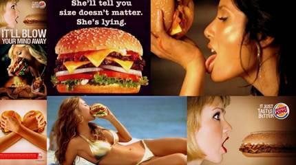

Figure 4

Of course, this strategy only appeals to a particular demographic's association with sex as a salient motivator. While teenage boys — the common target for these ads — may find them inspiring, others may find them distasteful. What motivates some people will not motivate others, a fact that provides all the more reason to understand the needs of your particular target audience.

Sometimes the psychological motivator is not as obvious as those used by Obama supporters or fast food chains. The Budweiser ad in figure 5 illustrates how the beer company uses the motivator of social cohesion by displaying three “buds,” cheering for their national team. Although beer is not directly related to social acceptance, the ad reinforces the association that the brand goes together with good friends and good times.

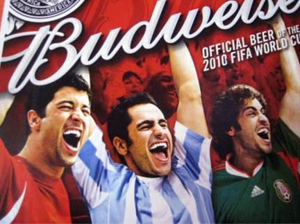

Figure 5

On the flip-side, negative emotions such as fear can also be powerful motivators. The ad in figure 6 shows a disabled man with a shocking head scar. The ad is impactful, communicating the risks of not wearing a motorcycle helmet. The words, "I won't wear a helmet it makes me look stupid," along with the patient’s mental age (post-motorcycle accident) of two-years old, send a chilling message.

Figure 6

As described in the previous chapter on triggers, understanding why the user needs your product or service is critical. While internal triggers are the frequent itch experienced by users throughout their days, the right motivators create action by offering the promise of desirable outcomes (i.e., a satisfying scratch).

However, even with the right trigger enabled and motivation running high, product designers often find users still don’t behave the way they want them to. What’s missing in this equation? Usability, or rather, the ability of the user to take action easily.

Ability

In his book, Something Really New: Three Simple Steps to Creating Truly Innovative Products[[lviii]](../Text/index_split_024.html#filepos364726), author Denis J. Hauptly deconstructs the process of innovation into its most fundamental steps. First, Hauptly says, understand the reason people use a product or service. Next, lay out the steps the customer must take to get the job done. Finally, once the series of tasks from intention to outcome is understood, simply start removing steps until you reach the simplest possible process.

Consequently, any technology or product that significantly reduces the steps to complete a task will enjoy high adoption rates by the people it assists. For Hauptly, easier equals better.

But can the nature of innovation be explained so succinctly? Perhaps a brief detour into the technology of the recent past will illustrate the point.

A few decades ago, a dial-up Internet connection seemed magical. All users had to do was boot-up their computers, hit a few keys on their desktop keyboards, wait for their modems to screech and scream as they established connections, and then, perhaps 30 seconds to a minute later, they were online. Checking email or browsing the nascent World Wide Web was terribly slow (by today’s standards), but offered unprecedented convenience compared to finding information any other way. The technology was remarkable and soon became a ritual for millions of people accessing this new marvel known as the Internet.

Of course, today few of us could stand the torture of using a 2400 baud modem after we’ve become accustomed to our always-on, high-speed Internet connections. Emails are now instantaneously pushed to the devices in our pockets. Our photos, music, videos, and files — not to mention the vastness of the open web — are accessible almost anywhere, anytime, on any connected device.

In line with Hauptly’s assertion, as the steps required to get something done (in this case, to get online and use the Internet) were removed or improved upon, adoption increased.

For example, consider the trend-line of the relationship between the percentage of people creating content online and the increasing ease of doing so, as shown in figure 7.

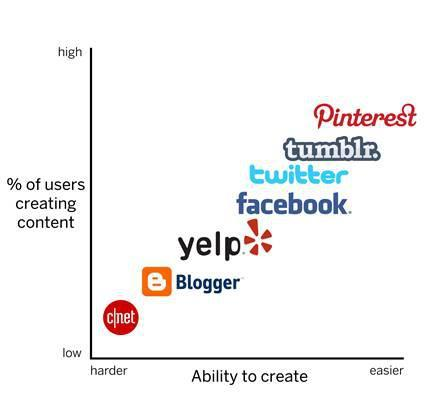

Figure 7

Web 1.0 was categorized by a few content providers like C|net (now called CNET) or the New York Times publishing to the masses, with only a tiny number of people creating what others read.

But in the late 1990s, blogging changed the web. Before blogging, amateur writers had to purchase their own domain, fiddle with DNS settings, find a web host, and set up a content-management system to present their writing. Suddenly, new companies like Blogger eliminated most of these steps by allowing users to simply register an account and start posting.

Evan Williams, who co-founded Blogger and later Twitter, echoes Hauptly’s formula for innovation when he describes his own approach to building two massively successful companies.[[lix]](../Text/index_split_024.html#filepos364935) “Take a human desire, preferably one that has been around for a really long time… Identify that desire and use modern technology to take out steps.” Blogger made posting content online dramatically easier. The result? The percentage of users creating content online, as opposed to simply consuming it, increased.

Along came Facebook and other social media tools, refining earlier innovations such as Bulletin Board Systems (BBS) and Really Simple Syndication (RSS) feeds into tools for status update-hungry users.

Then, seven years after Blogger’s birth, a new company described at first as a “micro-blogging” service sought to bring sharing to the masses — Twitter. For many, blogging was still too difficult and time-consuming. But anyone could type short, casual messages. “Tweeting” began to enter the national lexicon as Twitter gained wider adoption, climbing to 500 million registered users by 2012.[[lx]](../Text/index_split_024.html#filepos365211) Critics first discounted Twitter’s 140-character message limitation as gimmicky and restrictive. But little did they realize the constraint actually increased users’ ability to create. A few keyboard taps and users were sharing. As of late 2013, 340 million tweets were sent every day.

More recently, companies such as Pinterest, Instagram and Vine have elevated online content creation to a new level of simplicity. Now, just a quick snap of a photo or re-pin of an interesting image shares information across multiple social networks. The pattern of innovation shows that making a given action easier to accomplish spurs each successive phase of the web, helping to turn the once-niche behavior of content publishing into a mainstream habit.

As recent history of the web demonstrates, the ease or difficulty of doing a particular action impacts the likelihood that a behavior will occur. To successfully simplify a product, we must remove obstacles that stand in the user’s way. According to the Fogg Behavior Model, ability is the capacity to do a particular behavior.

\*\*\*

Fogg describes six “elements of simplicity” — the factors that influence a task’s difficulty.[[lxi]](../Text/index_split_024.html#filepos365585) These are:

- Time - How long it takes to complete an action.

- Money - The fiscal cost of taking an action.

- Physical Effort - The amount of labor involved in taking the action.

- Brain Cycles - The level of mental effort and focus required to take an action.

- Social Deviance - How accepted the behavior is by others.

- Non-Routine - According to Fogg, “How much the action matches or disrupts existing routines.”

To increase the likelihood of a behavior occurring, Fogg instructs designers to focus on simplicity as a function of the user's scarcest resource at that moment. In other words, identify what the user is missing. What is making it difficult for the user to accomplish the desired action?

Is the user short on time? Is the behavior too expensive? Is the user exhausted after a long day of work? Is the product too difficult to understand? Is the user in a social context where the behavior could be perceived as inappropriate? Is the behavior simply so far outside of the user’s normal routine that its strangeness is off-putting?

These factors will differ by person and context, so designers should ask, "What is the thing that is missing that would allow my users to proceed to the next step?" Designing with an eye toward simplifying the overall user experience reduces friction, removes obstacles, and helps push the user across Fogg’s action line.

The action phase of the Hook Model incorporates Fogg’s six elements of simplicity by asking designers to consider how their technology can facilitate the simplest actions in anticipation of reward. The easier an action, the more likely the user is to do it and to continue the cycle through the next phase of the Hook Model.

Below are examples of simple online interfaces used by a number of successful companies to prompt users to move quickly into the Hook’s next phase.

Logging In with Facebook

Traditionally, registering for a new account with an app or website requires several steps. The user is prompted to enter an email address, create a password, and submit other information such as a name or phone number. This burden introduces significant friction, detracting users from signing-up. Mobile devices present the special challenge of smaller screens and slower typing speeds.

However, today it is nearly impossible to browse the web or use a mobile app without encountering a Facebook Login prompt (figure 8). Many companies have eliminated several steps in the registration process by enabling users to register with their sites by using their existing Facebook credentials.

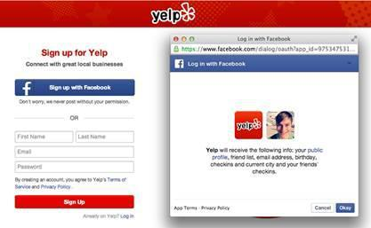

Figure 8

While the Facebook login function is useful for time-starved people, it should be noted that for others, the tool doesn’t necessarily ease registration. For example, users who are wary of how Facebook might share their personal information may not find the login button helpful because it may trigger new anxieties (and thus, brain cycles) about the social networking giant’s trustworthiness. Again, the roadblocks confronting users vary by person and context. There is no one-size-fits-all solution, so designers should seek to understand an array of possible user challenges.

 

Sharing with the Twitter Button

Twitter helps people share articles, videos, photos or any other content they find on the web. The company noticed that 25 percent of tweets contained a link and therefore sought to make the action of tweeting a website link as easy as possible.[[lxii]](../Text/index_split_024.html#filepos365785)

To ease the way for link-sharers, Twitter created an embeddable Tweet button for third-party sites, allowing them to offer visitors a one-click way to tweet directly from their pages (figure 9). The external trigger opens a preset message, reducing the cognitive effort of composing the tweet and saving several steps to sharing.

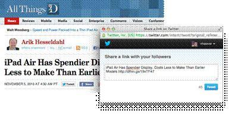

Figure 9

Searching with Google

Google, the world’s most popular search engine, was not the first to market. It competed against incumbents such as Yahoo!, Lycos, AltaVista, and Excite when it launched in the late 1990s. How did Google come to dominate the multi-billion dollar industry?

For one, Google’s PageRank algorithm proved to be a much more effective way to index the web. By ranking pages based on how frequently other sites linked to them, Google improved search relevancy. Compared with directory-based search tools such as Yahoo!, Google was a massive time-saver. But Google also beat out other search engines that had become polluted with irrelevant content and cluttered with advertising (figure 10). From its inception, Google’s clean and simple homepage and search results pages were solely focused on streamlining the act of searching and getting relevant results (figure 11).

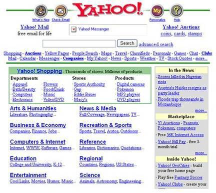

Figure 10 - The Yahoo homepage circa 1998

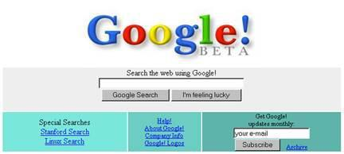

Figure 11 - The Google homepage circa 1998

Simply put, Google reduced the amount of time and the cognitive effort required to find what the user was looking for. The company continues to relentlessly improve its search engine by finding new ways to remove whatever might be in the user’s way — no matter how seemingly trivial. While its homepage remains remarkably pristine, Google now offers myriad tools to make searching easier and faster — including automatic spelling correction, predictive results based on partial queries, and search results that load even as the user is typing. Google’s efforts are intended to make searching easier to keep users coming back.

Taking Photos with the Apple iPhone

Many of life’s most treasured moments come and go in an instant. We try and capture these memories in photos, but if our camera is out of reach or too cumbersome to catch the shot, we lose those moments forever. Apple recognized it could help iPhone owners take more photos by making picture-taking easier. The company made the camera app directly launchable from the locked screen, without requiring a password. Compared to the number of steps needed to access photo apps on other smartphones, the simple flick gesture of the native iPhone camera gives it a virtual monopoly as users’ go-to solution whenever they need to snap a quick pic (figure 12).

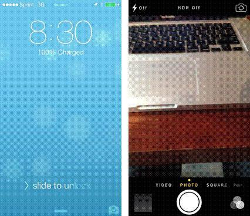

Figure 12

Scrolling with Pinterest

How can a website make browsing easier? One solution popularized by digital pinboard site, Pinterest, is the infinite scroll. In the past, getting from one web page to the next required clicking and waiting. However on sites such as Pinterest, whenever the user nears the bottom of a page, more results automatically load. Users never have to pause as they continue scrolling through pins or posts without end (figure 13).

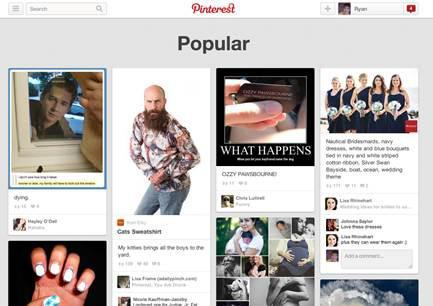

Figure 13

\*\*\*

The examples above show how simplicity increases the intended user behaviors.

 

Motivation or Ability — Which Should You Increase First?

After uncovering the triggers that prompt user actions and deciding which actions you want to turn into habits, you can increase motivation and ability to spark the likelihood of your users taking a desired behavior. But which should you invest in first, motivation or ability? Where is your time and money better spent?

The answer is always to start with ability.

Of course, all three parts of B=MAT must be present for a singular user action to occur; without a clear trigger and sufficient motivation, there will be no behavior. But for companies building technology solutions, the greatest return on investment will generally come from increasing a product’s ease-of-use.

The fact is, increasing motivation is expensive and time-consuming. Website visitors tend to ignore instructional text. Their attention is split on several tasks at once and they have little patience for explanations about why or how they should do something. Instead, influencing behavior by reducing the effort required to perform an action is more effective than increasing someone’s desire to do it. Make your product so simple that users already know how to use it, and you’ve got a winner.

The Evolution of Twitter’s Homepage

In 2009, the Twitter homepage was cluttered with text and dozens of links (figure 14). The page was confusing, especially for new users unfamiliar with the product. Twitter’s value proposition of sharing what you were doing with friends and family failed to resonate with most users, who wondered, "why would I want to broadcast my activities?" The page design demanded a high level of attention and comprehension.

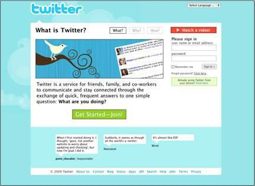

Figure 14 - The Twitter homepage in 2009

A year later, Twitter redesigned its homepage, touting itself as a service to “share and discover what’s happening” (figure 15). Although the page became more focused on action, it was still visually onerous. Even more unfortunate, the task users were most likely to do — search — was not what Twitter really wanted them to do. Twitter management knew from early users that those who followed other people on the service were more likely to stay engaged and form a habit. But searching on Twitter was not helping that goal, so the company decided to make another switch.

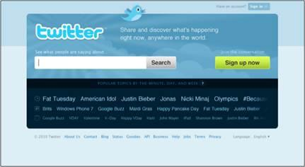

Figure 15 - The Twitter homepage in 2010

During the company’s period of hypergrowth, the Twitter homepage became radically more simple (figure 16). The product description is itself only 140 characters long and has evolved from the cognitively difficult request that users broadcast their information (as seen in 2009), to the less taxing “Find out what’s happening, right now, with the people and organizations you care about.”

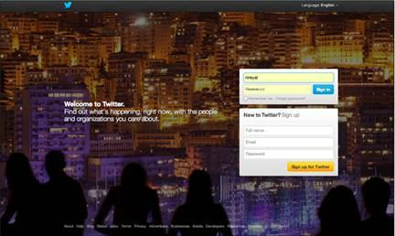

Figure 16 - The Twitter homepage in 2012

The big bold image of people looking into some kind of light-emanating event, like a concert or a soccer match, metaphorically communicates the value of the service while piquing curiosity. Most strikingly, the page has two very clear calls-to-action: sign in or sign up. The company made the desired action as simple as possible, knowing that getting users to experience the service would yield better results than trying to convince them to use it while still on the homepage.

Of course, it is worth noting that Twitter was in a different place in 2012 than in 2009. People came to the site having heard more about the service as its popularity grew. Twitter’s homepage evolution reveals how the company discovered its users’ scarcest resource. In 2009, the Twitter homepage attempted to boost motivation. But by 2012, Twitter had discovered that no matter how much users knew about the service, driving them to open an account and start following people resulted in much higher engagement.

Recently, Twitter’s homepage has been modified slightly to encourage downloading of the company’s mobile apps (figure 17). The simplicity of the large sign-in or sign-up triggers on the 2012 version remain, but Twitter now knows that driving users to install the app on their phones leads to the highest rates of repeat engagement.

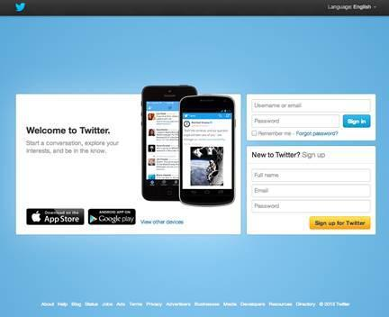

Figure 17 - The Twitter homepage in 2013

On Heuristics and Perception

So far, we have discussed Fogg’s Core Motivators and the six elements of simplicity as levers for influencing the likelihood of a particular behavior occurring. These factors echo ideals of how people react when making rational decisions. For example, every Economics 101 student learns that as prices decrease, consumers purchase more — in Fogg’s terms, an example of increasing ability by decreasing price.

However, although the principle seems elementary, the law, like many other theories of human behavior, has exceptions. The field of behavioral economics, as studied by luminaries such as Nobel Prize winner Daniel Kahneman, exposed exceptions to the rational model of human behavior. Even the notion that people always consume more if something costs less, for example, is a tendency, not an absolute.

There are many counterintuitive and surprising ways companies can boost users’ motivation or increase their ability by understanding heuristics — the mental shortcuts we take to make decisions and form opinions. It is worth mentioning a few of these brain biases. Even though users are often unaware of these influences on their behavior, heuristics can predict their actions.

The Scarcity Effect

In 1975, researchers Worchel, Lee, and Adewole wanted to know how people would value cookies in two identical glass jars.[[lxiii]](../Text/index_split_024.html#filepos366064) One jar held ten cookies while the other contained just two stragglers. Which cookies would people value more?

While the cookies and jars were identical, participants valued the ones in the near-empty jar more highly. The appearance of scarcity affected their perception of value.

There are many theories as to why this is the case. For one, scarcity may signal something about the product. If there are fewer of an item, the thinking goes, it might be because other people know something you don’t. Namely, that the cookies in the almost-empty jar are the better choice. The jar with just two cookies left in it conveys valuable, albeit irrelevant, information since the cookies are identical. Yet, the perception of scarcity changed their perceived value.

In the second part of their experiment, the researchers wanted to know what would happen to the perception of the value of the cookies if they suddenly became scarce or abundant. Groups of study participants were given jars with either two cookies or ten. Then, the people in the group with ten cookies suddenly had eight taken away. Conversely, those with only two cookies had eight new cookies added to their jars. How would these changes affect the way participants valued the cookies?

Results remained consistent with the scarcity heuristic. The group left with only two cookies rated them to be more valuable, while those experiencing sudden abundance by going from two to ten, actually valued the cookies less. In fact, they valued the cookies even lower than people who had started with ten cookies to begin with. The study showed that a product can decrease in perceived value if it starts off as scarce and becomes abundant.

For an example of how perception of a limited supply can increase sales, look no further than Amazon.com. My recent search for a DVD revealed there were “only 14 left in stock” (figure 18), while a search for a book I’ve had my eye on says only three copies remain. Is the world’s largest online retailer almost sold out of nearly everything I want to buy or are they using the scarcity heuristic to influence my buying behavior?

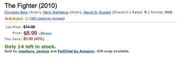

Figure 18 - “Only 14 left in stock”?

 

The Framing Effect

Context also shapes perception. In a social experiment, world-class violinist Joshua Bell decided to play a free impromptu concert in a Washington, DC subway station.[[lxiv]](../Text/index_split_024.html#filepos366360) Bell regularly sells out venues such as the Kennedy Center and Carnegie Hall for hundreds of dollars per ticket, but when placed in the context of the DC subway, his music fell upon deaf ears. Almost nobody knew they were walking past one of the most talented musicians in the world.

The mind takes shortcuts informed by our surroundings to make quick and sometimes erroneous judgments. When Bell performed his concert in the subway station, few stopped to listen. But when framed in the context of a concert hall, he can charge beaucoup bucks.

But the framing heuristic not only influences our behaviors — it literally changes how our brain perceives pleasure. For example, a 2007 study attempted to measure if price had any influence on the taste of wine.[[lxv]](../Text/index_split_024.html#filepos366608) The researchers had study participants sample wine while in an fMRI machine.

As the machine scanned the blood flow in the various regions of their brains, the tasters were informed of the cost of each wine sampled. The sample started with a $5 wine and progressed to a $90 bottle. Interestingly, as the price of the wine increased, so did the participant's enjoyment of the wine. Not only did they say they enjoyed the wine more but their brain corroborated their feelings, showing higher spikes in the regions associated with pleasure. Little did the study participants realize, they were tasting the same wine each time. This study demonstrates how perception can form a personal reality based on how a product is framed, even when there is little relationship with objective quality.

The Anchoring Effect

Rarely can you walk into a clothing store without seeing signage for “30% off,” “buy-one-get-one free,” and other sales and deals. In reality, these items are often marketed to maximize profits for the business. Often, the same store will have similar but less expensive (yet non-discounted) products. I recently visited a store that offered a package of three Jockey brand undershirts at a buy-one-get-one-half-off discount for $29.50. After surveying other options, I noticed a package of five Fruit of the Loom brand undershirts selling for $34. After some quick math, I discovered that the shirts not on sale were actually cheaper per-shirt than the “discounted” brand’s package.

People often anchor to one piece of information when making a decision. I almost bought the shirts on sale assuming that the one feature differentiating the two brands — the fact that one was on sale and the other was not — was all I needed to consider.

The Endowed Progress Effect

Punch cards are often used by retailers to encourage repeat business. With each purchase, customers get closer to receiving a free product or service. These cards are typically awarded empty and in effect, customers start at zero percent complete. What would happen if retailers handed customers punch cards with punches already given? Would people be more likely to take action if they had already made some progress? An experiment sought to answer this very question.[[lxvi]](../Text/index_split_024.html#filepos366961)

Two groups of customers were given punch cards awarding a free car wash once the cards were fully punched. One group was given a blank punch card with 8 squares and the other given a punch card with 10 squares but with two free punches. Both groups still had to purchase 8 car washes to receive a free wash; however, the second group of customers — those that were given two free punches — had a staggering 82 percent higher completion rate. The study demonstrates the endowed progress effect, a phenomenon that increases motivation as people believe they are nearing a goal.

Sites such as LinkedIn and Facebook utilize this heuristic to encourage people to divulge more information about themselves when completing their online profiles. On LinkedIn, every user starts with some semblance of progress (figure 19). The next step is to “Improve Your Profile Strength” by supplying additional information. As users complete each step, the meter incrementally shows the user is advancing. Cleverly, LinkedIn’s completion bar jumpstarts the perception of progress and does not include a numeric scale. For the new user, a proper LinkedIn profile does not seem so far away. But even the “advanced” user still has additional steps she can take to inch toward the final goal.

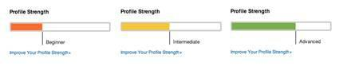

Figure 19

\*\*\*

Most people remain unaware of how heuristics help us make split-second decisions multiple times per day. Psychologists believe there are hundreds of cognitive biases that influence our behaviors and the four discussed here are just a few examples.[[lxvii]](../Text/index_split_024.html#filepos367283) For product designers building habit-forming technology, understanding and leveraging these methods for boosting motivation and ability can prove highly impactful.

Stephen Anderson, author of Seductive Interaction Design, created a tool called Mental Notes to help designers build better products through heuristics.[[lxviii]](../Text/index_split_024.html#filepos367534) Each of the cards in his deck of 50 contains a brief description of a cognitive bias and is intended to spark product team conversations around how they might utilize the principle. For example, team members might ask themselves how they could utilize the endowed progress effect or the scarcity effect to increase the likelihood of a desired user behavior.

In this chapter, we discovered how to take users from trigger to action. We discussed how cognitive biases influence behavior and how by designing the simplest action in anticipation of a reward, product makers can advance users to the next phase of the Hook Model.

Now that users have passed through the first two phases, it is time to give them what they came for — the reward that scratches their itch. But what is it exactly that users want? What keeps us coming back time and again to habit-forming experiences and technologies? The answer to what we’re all searching for is the topic of the next chapter.

\*\*\*

Remember and Share

- Action is the second step in The Hook.

- The action is the simplest behavior in anticipation of reward.

- As described by the Dr. BJ Fogg’s Behavior Model:

- For any behavior to occur, a trigger must be present at the same time as the user has sufficient ability and motivation to take action.

- To increase the desired behavior, ensure a clear trigger is present, then increase ability by making the action easier to do, and finally align with the right motivator.

- Every behavior is driven by one of three Core Motivators: seeking pleasure or avoiding pain, seeking hope and avoiding fear, seeking social acceptance while avoiding social rejection.

- Ability is influenced by the six factors of time, money, physical effort, brain cycles, social deviance, and non-routineness. Ability is dependent on users and their context at that moment.

- Heuristics are cognitive shortcuts we take to make quick decisions. Product designers can utilize many of the hundreds of heuristics to increase the likelihood of their desired action.

\*\*\*

Do This Now

Refer to the answers you came up with in the last “Do This Now” section to complete the following exercises:

- Walk through the path your users would take to use your product or service, beginning from the time they feel their internal trigger to the point where they receive their expected outcome. How many steps does it take before users obtain the reward they came for? How does this process compare with the simplicity of some of the examples described in this chapter? How does it compare with competing products and services?

- Which resources are limiting your users’ ability to accomplish the tasks that will become habits?

> > - Time

> > - Money

> > - Physical effort

> > - Brain cycles (too confusing)

> > - Social deviance (outside the norm)

> > - Non-routine (too new)

- Brainstorm three testable ways to make the intended tasks easier to complete.

-  Consider how you might apply heuristics to make habit-forming actions more likely.

[*OceanofPDF.com*](https://oceanofpdf.com)

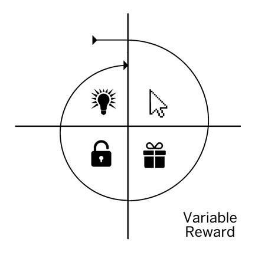

[*OceanofPDF.com*](https://oceanofpdf.com)
