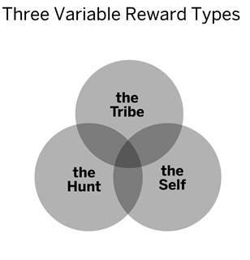
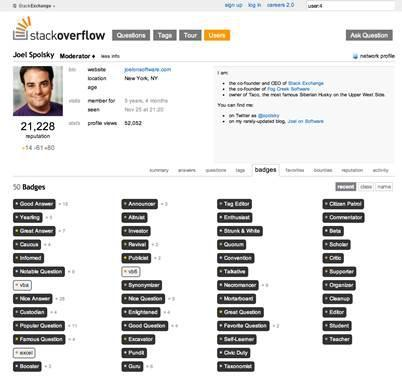
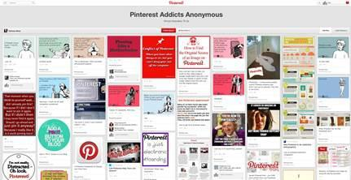
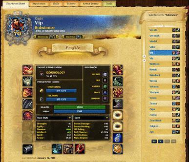
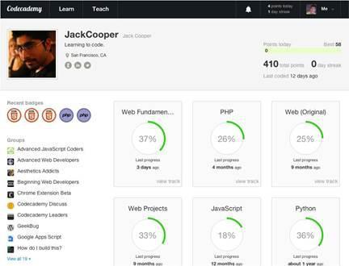
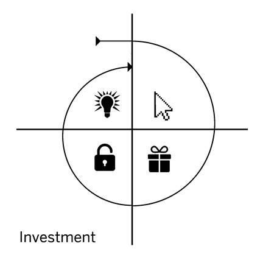

# 4. Variable Reward

4. VARIABLE REWARD

 

Ultimately, all businesses help users achieve an objective. As we learned in the previous chapter, reducing the steps needed to complete the intended outcome increases the likelihood of that outcome. But to keep users engaged, products need to deliver on their promises. To form the learned associations we discussed in the chapter on triggers, users must come to depend on the product as a reliable solution to their problem — the salve for the itch they came to scratch.

The third step in the Hook Model is the Variable Reward phase. In this phase, you reward your users by solving a problem, reinforcing their motivation for the action taken in the previous phase. But to understand why rewards — and variable rewards in particular — are so powerful, we must first take a trip deep inside the brain.

Understanding Rewards

In the 1940s, two researchers named James Olds and Peter Milner accidentally discovered how a special area of the brain is the source of our cravings. The researchers implanted electrodes in the brains of lab mice that enabled the mice to give themselves tiny electric shocks to a small area of the brain called the nucleus accumbens.[[lxix]](../Text/index_split_024.html#filepos367833) The mice quickly became hooked on the sensation.

Olds and Milner demonstrated that the lab mice would forgo food, water, and even run across a painful electrified grid for the opportunity to continue pressing the lever that administered the shocks. A few years later, other researchers tested the human response to self-administered stimulus in the same area of the brain. The results were just as dramatic as in the mouse trial — subjects wanted to do nothing but press the brain-stimulating button. Even when the machine was turned off, people continued pressing the button. Researchers even had to forcibly take the devices from subjects who refused to relinquish them.

Given the responses they had earlier demonstrated from lab animals, Olds and Milner concluded that they had discovered the brain’s pleasure center. In fact, we now know other things that feel good also activate the same neural region. Sex, delicious food, a bargain, and even our digital devices all tap into this deep recess of the brain, providing the impetus for many of our behaviors.

However, more recent research has shown that Olds and Milner’s experiments were not stimulating pleasure per se. Stanford Professor Brian Knutson, conducted a study exploring blood flow in the brains of people wagering while inside of an fMRI machine.[[lxx]](../Text/index_split_024.html#filepos368122) The test subjects played a gambling game while Knutson and his team looked at which areas of their brains became more active. The startling results showed that the nucleus accumbens was not activating when the reward (in this case a monetary payout) was received, but rather, in anticipation of it.

The study revealed that what draws us to act is not the sensation we receive from the reward itself, but the need to alleviate the craving for that reward. The stress of desire in the brain appears to compel us, just as it did in Olds’ and Milner’s lab mouse experiments.

Understanding Variability

If you’ve never watched a YouTube video of a baby’s first encounter with a dog, it’s worth doing. Not only are these videos incredibly cute, but they help demonstrate something important about our mental wiring.

At first, the expression on the baby’s face seems to ask, “What is this hairy monster doing in my house? Will it hurt me? What will it do next?” The child is filled with curiosity, uncertain if this creature might cause harm. But soon the child figures out Rover is not a threat. What follows is an explosion of infectious giggles. Researchers believe laughter may in fact be a release valve when we experience the discomfort and excitement of uncertainty, but without fear of harm.[[lxxi]](../Text/index_split_024.html#filepos368456)

What we do not see in the videos is what happens over time. A few years later, what was once thrilling about Rover, no longer holds the child’s attention in the same way. The child has learned to predict the dog’s behavior and no longer finds the pup quite as entertaining. By now, the child’s mind is occupied with dump trucks, fire engines, bicycles, and new toys that stimulate the senses — until they too become predictable. Without variability, we are like children in that once we figure out what will happen next, we become less excited by the experience. The same rules that apply to puppies also apply to products. To hold our attention, products must have an ongoing degree of novelty.

Our brains have evolved over millennia to help us figure out how things work. Once we understand causal relationships, we retain that information in memory. Our habits are simply the brain's ability to quickly retrieve the appropriate behavioral response to a routine or process we have already learned. Habits help us conserve our attention for other things while we go about the tasks we perform with little or no conscious thought.

However, when something breaks the cause-and-effect pattern we've come to expect — when we encounter something outside the norm — we suddenly become aware of it again.[[lxxii]](../Text/index_split_024.html#filepos368657) Novelty sparks our interest, makes us pay attention, and — like a baby encountering a friendly dog for the first time — we seem to love it.

Rewards of the Tribe, Hunt, and Self

In the 1950s, psychologist B.F. Skinner conducted experiments to understand how variability impacted animal behavior.[[lxxiii]](../Text/index_split_024.html#filepos368993) First, Skinner placed pigeons inside a box rigged to deliver a food pellet to the birds every time they pressed a lever. Similar to Olds’ and Milner’s lab mice, the pigeons learned the cause-and-effect relationship between pressing the lever and receiving the food.

In the next part of the experiment, Skinner added variability. Instead of providing a pellet every time a pigeon tapped the lever, the machine discharged food after a random number of taps. Sometimes the lever would dispense food, sometimes not. Skinner revealed that the intermittent reward dramatically increased the number of times the pigeons tapped the lever. Adding variability increased the frequency of the pigeons completing the intended action.

Skinner’s pigeons tell us a great deal about what helps drive our own behaviors. More recent experiments reveal that variability increases activity in the nucleus accumbens and spikes levels of the neurotransmitter dopamine, driving our hungry search for rewards.[[lxxiv]](../Text/index_split_024.html#filepos369175) Researchers observed increased dopamine levels in the nucleus accumbens in experiments involving monetary rewards as well as in a study of heterosexual men viewing images of attractive women’s faces.[[lxxv]](../Text/index_split_024.html#filepos369408)

Variable rewards can be found in all sorts of products and experiences that hold our attention. They fuel our drive to check email, browse the web, or bargain-shop. I propose that variable rewards come in three types: Tribe, hunt and self (figure 20). Habit-forming products utilize one or more of these variable reward types.

Figure 20

 

Rewards of the Tribe

We are a species that depends on each other. Rewards of the tribe, or social rewards, are driven by our connectedness with other people. Our brains are adapted to seek rewards that make us feel accepted, attractive, important, and included. Many of our institutions and industries are built around this need for social reinforcement. From civic and religious groups to spectator sports and “watercooler” television shows, the need to feel social connectedness shapes our values and drives much of how we spend our time.

It is no surprise that social media has exploded in popularity. Facebook, Twitter, Pinterest, and several other sites collectively provide over a billion people with powerful social rewards on a variable schedule. With every post, tweet, or pin, users anticipate social validation. Rewards of the tribe keep users coming back, wanting more.

Sites that leverage tribal rewards benefit from what psychologist Albert Bandura called “social learning theory.”[[lxxvi]](../Text/index_split_024.html#filepos369644) Bandura studied the power of modeling and ascribed special powers to our ability to learn from others. In particular, Bandura showed that people who observe someone being rewarded for a particular behavior are more likely to alter their own beliefs and subsequent actions. Notably, Bandura also showed that this technique works particularly well when people observe the behavior of people most like themselves, or those who are slightly more experienced (and, therefore, role models).[[lxxvii]](../Text/index_split_024.html#filepos369846) This is exactly the kind of targeted demographic and interest-level segmentation that social media companies such as Facebook and industry-specific sites such as Stack Overflow selectively apply.

Here are some online examples of rewards of the tribe:

Facebook

Facebook provides numerous examples of variable social rewards. Logging-in reveals an endless stream of content friends have shared, comments from others, and running tallies of how many people have “liked” something (figure 21). The uncertainty of what users will find each time they visit the site creates the intrigue needed to pull them back again.

While variable content gets users to keep searching for interesting tidbits in their Newsfeeds, a click of the “Like” button provides a variable reward for the content’s creators. “Likes” and comments offer tribal validation for those who shared the content, and provide variable rewards that motivate them to continue posting.

Figure 21

 

Stack Overflow

Stack Overflow is the world’s largest question-and-answer site for software developers. As with other user-generated content sites such as Quora, Wikipedia, and YouTube, all of Stack Overflow’s content is created voluntarily by people who use the site. A staggering 5,000 answers to questions are generated per day by site members. Many of these responses provide detailed, highly technical and time-consuming answers. But why do so many people spend so much time doing all this work for free? What motivates them to invest the effort into what others may see as the burdensome task of writing technical documentation?

Stack Overflow devotees write responses in anticipation of rewards of the tribe. Each time a user submits an answer, other members have the opportunity to vote the response up or down. The best responses percolate upwards, accumulating points for their authors (figure 22). When they reach certain point levels, members earn badges, which confer special status and privileges. Of course, the process of accumulating upvotes (and, therefore, points and badges) is highly variable — no one knows how many they will receive from the community when responding to a question.

Figure 22

Stack Overflow works because, like all of us, software engineers find satisfaction in contributing to a community they care about; and the element of variability turns a seemingly mundane task into an engaging, game-like experience. But on Stack Overflow, points are not just an empty game mechanic, they confer special value by representing how much someone has contributed to their tribe. Users enjoy the feeling of helping their fellow programmers and earning the respect of people whose opinions they value.

League of Legends

League of Legends, a popular computer game, launched in 2009 and quickly achieved tremendous success. But soon after its launch, the game’s owners found they had a serious problem: The online video game was filled with “trolls” — people who enjoyed bullying other players while being protected by the anonymity the game provides. Soon, League of Legends earned a nasty reputation for having an “unforgiving — even abusive — community.”[[lxxviii]](../Text/index_split_024.html#filepos370012) A leading industry publication wrote, “League of Legends has become well known for at least two things: proving the power of the free-to-play model in the West and a vicious player community.”[[lxxix]](../Text/index_split_024.html#filepos370315)

To combat the trolls, the game creators designed a reward system leveraging Bandura’s social learning theory, which they called Honor Points (figure 23). The system gave players the ability to award points for particularly sportsmanlike conduct worthy of recognition. These virtual kudos encouraged positive behavior and helped the best and most cooperative players to stand out in the community. The number of points earned was highly variable and could only be conferred by other players. Honor Points soon became a coveted marker of tribe-conferred status and helped weed out trolls by signaling to others which players should be avoided.

Figure 23

Rewards of the Hunt

For years, scientists have tried to answer a central question of human evolution: How did early humans hunt for food? Most evolutionary biologists agree that consuming animal protein was a significant milestone that led to better nutrition and, ultimately, bigger brains but the tactical details of the hunt remain hazy.[[lxxx]](../Text/index_split_024.html#filepos370619) We know our ancestors handcrafted spears and arrows for hunting, but evidence shows that these weapons were only invented 500,000 years ago,[[lxxxi]](../Text/index_split_024.html#filepos370937) whereas we’ve been eating meat for over 2 million years.[[lxxxii]](../Text/index_split_024.html#filepos371257) How then, did we hunt during the first 75 percent of our existence?

According to Harvard evolutionary biologist Daniel Lieberman, we chased down our dinner. Early humans killed animals using a technique known as “persistence hunting,” a practice still common among today’s few remaining pre-agrarian societies. One of these groups, the San people of Southern Africa, hunt for kudu, a large deer-like animal, using a technique similar to the way Lieberman believes humans hunted for the vast majority of our species’ history. The way we evolved to hunt wild game may help explain why we find ourselves compelled to use certain products today.

In Africa, the chase begins when a group of San hunters separate a large kudu bull from the herd. The animal’s heavy antlers slows him down, making him less agile than the female kudus. Once the animal is isolated from the pack, a single San hunter begins the hunt, keeping a steady pace as the animal leaps ahead in fear. At first, it appears the man will never catch up to the bounding beast. At times he struggles to keep the animal in sight through the dry brush.

But the hunter knows he can use the animal’s weaknesses to his advantage. The powerful kudu is much faster in short sprints, but the kudu’s skin is covered with fur and can not dissipate heat like the runner’s skin can. According to Lieberman, “Quadrupeds can not pant and gallop at the same time.”[[lxxxiii]](../Text/index_split_024.html#filepos371576) So while the kudu must stop to catch his breath, the hunter begins closing in, not to catch it but to run it to exhaustion.

After being tracked for a sweltering eight hours under the African sun, the beast is finally ready to give up, collapsing in surrender with barely a struggle. The meager hundred-pound San hunter outlasts the powerful 500 pound beast with little more than his persistence and the biomechanical gifts evolution has given him. The hunter swiftly and ceremoniously kills his prize, piercing a vein in the animal’s neck so that he can feed his children and his tribe.

By running on two feet and bereft of the body hair typical of other primates, our species gained a massive advantage over larger mammals. Our ability to maintain steady pursuit gave us the capacity to hunt large prehistoric game. But persistence hunting was not only made possible because of our bodies; changes in our brains also played a significant role.

During the chase, the runner is driven by the pursuit itself; and this same mental hardwiring also provides clues into the source of our insatiable desires today. The dogged determination that keeps San hunters chasing kudu is the same mechanism that keeps us wanting and buying. Although it is a long way from bushmen to businessmen, the mental processes of the hunt remain largely the same.

The search for resources defines the next type of variable reward — the rewards of hunt. The need to acquire physical objects, such as food and other supplies that aid our survival, is part of our brain’s operating system. But where we once hunted for food, today we hunt for other things. In modern society, food can be bought with cash, and more recently by extension, information translates into money.

Rewards of the hunt existed long before the advent of computers. But today we find numerous examples of variable rewards associated with the pursuit of resources and information that compel us with the same determination as the San hunter chasing his prey.

Here are a few examples of products that create habits by leveraging rewards of the hunt:

 

Machine Gambling

Most people know that gambling benefits the casino or broker far more than the players. As the old adage says, “the house always wins.” Yet despite this knowledge, the multi-billion dollar gambling industry continues to thrive.

Slot machines provide a classic example of variable rewards of the hunt. Gamblers plunk $1 billion per day into slot machines in American casinos, which is a testament to the machines’ power to compel players.[[lxxxiv]](../Text/index_split_024.html#filepos371780) By awarding money in random intervals, games of chance entice players with the prospect of a jackpot. Of course, winning is entirely outside the gambler’s control — yet the pursuit can be intoxicating.

Twitter

The “feed” has become a social staple of many online products. The stream of limitless information displayed in a scrolling interface makes for a compelling reward of the hunt. The Twitter timeline, for example, is filled with a mix of both mundane and relevant content. This variety creates an enticingly unpredictable user experience. On occasion a user might find a particularly interesting piece of news, while other times, she won’t. But to keep hunting for more information, all that is needed is a flick of the finger or scroll of a mouse. Users scroll and scroll and scroll to search for variable rewards in the form of relevant tweets (figure 24).

Figure 24

Pinterest

Pinterest, a company that has grown to reach over 50 million monthly users worldwide, also employs a feed, but with a visual twist.[[lxxxv]](../Text/index_split_024.html#filepos372030) The online pinboarding site is a virtual smorgasbord of objects of desire. The site is curated by its community of users who ensure that a high degree of intriguing content appears on each page.

Pinterest users never know what they will find on the site. To keep them searching and scrolling, the company employs an unusual design. As the user scrolls to the bottom of the page, some images appear to be cut-off. Often, images appear out of view below the browser fold. However, these images offer a glimpse of what's ahead, even if just barely visible. To relieve their curiosity, all users have to do is scroll to reveal the full picture (figure 25). As more images load on the page, the endless search for variable rewards of the hunt continues.

Figure 25

 

Rewards of the Self

Finally, there are the variable rewards we seek for a more personal form of gratification. We are driven to conquer obstacles, even if just for the satisfaction of doing so. Pursuing a task to completion can influence people to continue all sorts of behaviors.[[lxxxvi]](../Text/index_split_024.html#filepos372358) Surprisingly, we even pursue these rewards when we don’t outwardly appear to enjoy them. For example, watching someone investing countless hours into completing a tabletop puzzle can reveal frustrated face contortions and even sounds of muttered profanity. Although puzzles offer no prize other than the satisfaction of completion, for some the painstaking search for the right pieces can be a wonderfully mesmerizing struggle.

The rewards of the self are fueled by “intrinsic motivation” as highlighted by the work of Edward Deci and Richard Ryan.[[lxxxvii]](../Text/index_split_024.html#filepos372559) Their self-determination theory espouses that people desire, among other things, to gain a sense of competency. Adding an element of mystery to this goal makes the pursuit all the more enticing.

The experiences below offer examples of variable rewards of the self:

Video Games

Rewards of the self are a defining component in video games, as players seek to master the skills needed to pursue their quest. Leveling up, unlocking special powers, and other game mechanics fulfill a player's desire for competency by showing progression and completion.

For example, advancing a character through the popular online game World of Warcraft unlocks new abilities for the player (figure 26). The thirst to acquire advanced weaponry, visit uncharted lands, and improve their characters’ scores motivates players to invest more hours in the game.

Figure 26

Email

You do not have to be a hard-core video gamer to be heavily influenced by game-like experiences. The humble email system provides an example of how the search for mastery, completion, and competence moves users to habitual, sometimes mindless, actions. Have you ever caught yourself checking your email for no particular reason? Perhaps you unconsciously decided to open it to see what messages might be waiting for you. For many, the number of unread messages represents a sort of goal to be completed.

But to feel rewarded, the user must have a sense of accomplishment. Mailbox, an email application acquired by Dropbox in 2013 for a rumored $100 million, aims to solve the frustration of fighting what feels like a losing inbox battle.[[lxxxviii]](../Text/index_split_024.html#filepos372864) Mailbox cleverly segments emails into sorted folders to increase the frequency of users achieving “inbox zero” — a near-mystical state of having no unread emails (figure 27). Of course, some of the folder sorting is done through digital sleight-of-hand by pushing some low priority emails out of sight, and then having them reappear at a later date. But by giving users the sense that they are processing their inbox more efficiently, Mailbox delivers something other email clients do not — a feeling of completion and mastery.

Figure 27

 

Codecademy

Learning to program is not easy. Software engineers take months, if not years, of diligent hard work before they have the confidence and skill to write useful code. Many people attempt to learn how to write software, only to give up, frustrated at the tedious process of learning a new computer language.

Codecademy seeks to make learning to write code more fun and rewarding. The site offers step-by-step instructions for building a web app, animation, and even a browser-based game. The interactive lessons deliver immediate feedback, in contrast to traditional methods of learning to code by writing whole programs. At Codecademy, users can enter a single correct function and the code works or doesn’t, providing instant feedback.

Learning a new skill is often filled with errors but Codecademy uses the difficulty to its advantage. There is a constant element of the unknown when it comes to completing the task at hand and like a game, users receive variable rewards as they learn — sometimes they succeed, sometimes they fail. But as their competency level improves, users work to advance through levels, mastering the curriculum. Codecademy’s symbols of progression and instantaneous variable feedback tap into rewards of the self, turning a difficult path into an engaging challenge (figure 28).

Figure 28

\*\*\*

Important Considerations for Designing Reward Systems

Variable Rewards Are Not a Free Pass

In May 2007, a site called Mahalo.com was born. A flagship feature of the new site was a question-and-answer forum known as Mahalo Answers. Unlike previous Q&A sites, Mahalo utilized a special incentive to get users to ask and answer questions.

First, people who submitted a question would offer a bounty in the form of a virtual currency known as “Mahalo Dollars.” Then, other users would contribute answers to the question and the best response would receive the bounty, which could be exchanged for real money. By providing a monetary reward, the Mahalo founders believed they could drive user engagement and form new online user habits.

At first, Mahalo garnered significant attention and traffic. At its high point, 14.1 million users worldwide visited the site monthly.[[lxxxix]](../Text/index_split_024.html#filepos373140) But over time, users began to lose interest. Although the payout of the bounties were variable, somehow users did not find the monetary rewards enticing enough.

But as Mahalo struggled to retain users, another Q&A site began to boom. Quora, launched in 2010 by two former Facebook employees, quickly grew in popularity. Unlike Mahalo, Quora did not offer a single cent to anyone answering user questions. Why, then, have users stayed highly engaged with Quora, but not with Mahalo, despite its variable monetary rewards?

In Mahalo’s case, executives assumed that paying users would drive repeat engagement with the site. After all, people like money, right? Unfortunately, Mahalo had an incomplete understanding of its users’ drivers.

Ultimately, the company found that people did not want to use a Q&A site to make money. If the trigger was a desire for monetary rewards, the user was better off spending their time earning an hourly wage. And if the payouts were meant to take the form of a game, like a slot machine, then the rewards came far too infrequently and were too small to matter.

However, Quora demonstrated that social rewards and the variable reinforcement of recognition from peers proved to be much more frequent and salient motivators. Quora instituted an upvoting system that reports user satisfaction with answers and provides a steady stream of social feedback. Quora’s social rewards have proven more attractive than Mahalo’s monetary rewards.

Only by understanding what truly matters to users can a company correctly match the right variable reward to their intended behavior.

Recently, “gamification” — defined as the use of game-like elements in non-gaming environments — has been used with varying success. Points, badges, and leaderboards can prove effective, but only if they scratch the user’s itch. When there is a mismatch between the customer’s problem and the company’s assumed solution, no amount of gamification will help spur engagement. Likewise, if the user has no ongoing itch at all — say, no need to return repeatedly to a site that lacks any value beyond the initial visit — gamification will fail because of a lack of inherent interest in the product or service offered. In other words, gamification is not a one-size-fits-all solution for driving user engagement.

Variable rewards are not magic fairy dust that a product designer can sprinkle onto a product to make it instantly more attractive. Rewards must fit into the narrative of why the product is used and align with the user's internal triggers and motivations.

Maintain a Sense of Autonomy

Quora found success by connecting the right reward to the intended behavior of asking and answering questions. But in August 2012, the company committed a very public blunder — one that illustrates another important consideration when using variable rewards.

In an effort to increase user engagement, Quora introduced a new feature called “views,” which revealed the real identity of people visiting a particular question or answer. For users, the feedback of knowing who was seeing content they added to the site proved very intriguing. Users could now know, for example, when a celebrity or prominent venture capital investor viewed something they created.

However, the feature ultimately backfired. Quora automatically opted users into the new feature without alerting them that their browsing history on the site would be exposed to others. In an instant, users lost their treasured anonymity when asking, answering, or simply viewing Quora questions that were personal, awkward, or intimate.[[xc]](../Text/index_split_024.html#filepos373506) The move sparked a user revolt and Quora reversed course a few weeks later, making the feature explicitly opt-in.[[xci]](../Text/index_split_024.html#filepos373818)

In the case of Quora, the change felt forced and bordered on coercion. While influencing behavior can be a part of good product design, heavy-handed efforts can have adverse consequences and risk losing users’ trust.

We’ll address the morality of manipulation in a later chapter — but aside from the ethical considerations, there is an important point regarding the psychological role of autonomy and how it can impact user engagement.

As part of a French study, researchers wanted to know if they could influence how much money people handed to a total stranger asking for bus fare by using just a few specially encoded words. They discovered a technique so simple and effective it doubled the amount people gave.

The turn of phrase has not only proven to increase how much bus fare people give, but has also been effective in boosting charitable donations and participation in voluntary surveys. In fact, a recent meta-analysis of 42 studies involving over 22,000 participants concluded that these few words, placed at the end of a request, are a highly-effective way to gain compliance, doubling the likelihood of people saying “yes.”[[xcii]](../Text/index_split_024.html#filepos374012)

The magic words the researchers discovered? The phrase, “but you are free to accept or refuse.”

The “but you are free” technique demonstrates how we are more likely to be persuaded when our ability to choose is reaffirmed. Not only was the effect observed during face-to-face interactions, but also over email. Although the research did not directly look at how products and services might use the technique, the study provides an important insight into how companies maintain or lose the user’s attention.

Why does reminding people of their freedom to choose, as demonstrated in the French bus fare study, prove so effective?

The researchers believe the phrase “but you are free” disarms our instinctive rejection of being told what to do. If you have ever grumbled at your mother telling you to put on a coat or felt your blood pressure rise when your boss micro-manages you, you have experienced what psychologists call “reactance,” the hair-trigger response to threats to your autonomy.

However, when a request is coupled with an affirmation of the right to choose, reactance is kept at bay. But can the principles of autonomy and reactance carry over into the way products change user behavior and drive the formation of new user habits? Here are two examples to make the case that they do, but of course, you are free to make up your mind for yourself.

Take, for example, establishing the habit of better nutrition, a common goal for many Americans. Searching in the Apple App Store for the word “diet” returns 3,235 apps, all promising to help users shed extra pounds. The first app in the long list is MyFitnessPal, whose iOS app is rated by over 350,000 people.

A year ago when I decided to lose a few pounds, I installed the app and gave it a try. MyFitnessPal is simple enough to use. The app asked me to log what I ate and presented me with a calorie score based on my weight loss goal.

For a few days, I stuck with the program and diligently input information about everything I ate. Had I been a person who logs food with pen and paper, MyFitnessPal would have been a welcome improvement.

However, I was not a calorie tracker prior to using MyFitnessPal and although using the app was novel at first, it soon became a drag. Keeping a food diary was not part of my daily routine and was not something I came to the app wanting to do. I wanted to lose weight and the app was telling me how to do it with its strict method of tracking calories in and calories out. Unfortunately, I soon found that forgetting to enter a meal made it impossible to get back on the program – the rest of my day was a nutritional wash.

Soon, I began to feel obligated to confess my mealtime transgressions to my phone. MyFitnessPal became MyFitnessPain. Yes, I had chosen to install the app at first, but despite my best intentions, my motivation faded and using the app became a chore. Adopting a weird new behavior — calorie tracking, in my case — felt like something I had to do, not something I wanted to do. My only options were to comply or quit. So I quit.

On the other hand Fitocracy, another health app, approaches behavior change very differently. The goal of the app is similar to its competitors — to help people establish better diet and exercise routines. However, it leverages familiar behaviors users want to do, instead of have to do.

At first, the Fitocracy experience is similar to other health apps, encouraging new members to track their food consumption and exercise. But where Fitocracy differentiates itself is in its recognition that most users will quickly fall off the wagon, just as I had with MyFitnessPal, unless the app taps into existing autonomous behavior.

Before my reactance alarm went off, I started receiving kudos from other members of the site after entering my very first run. Curious to know who was sending the virtual encouragement, I logged in. There, I immediately saw a question from “mrosplock5,” a woman looking for advice on what to do about knee pain from running. Having experienced similar trouble several years back, I left a quick reply: “Running barefoot (or with minimalist shoes) eliminated my knee pains. Strange but true!”

I have not used Fitocracy for long, but it is easy to see how someone could get hooked. Fitocracy is first and foremost an online community. The app roped me in by closely mimicking real-world gym jabber among friends. The ritual of connecting with like-minded people existed long before Fitocracy, and the company leverages this behavior by making it easier and more rewarding to share encouragement, exchange advice, and receive praise. In fact, a recent study found social factors were the most important reasons people used the service and recommended it to others.[[xciii]](../Text/index_split_024.html#filepos374300)

Social acceptance is something we all crave, and Fitocracy leverages the universal need for connection as an on-ramp to fitness, making new tools and features available to users as they develop new habits. The choice for the Fitocracy user is therefore between the old way of doing an existing behavior and the company’s tailored solution for easing the user into healthy new habits.

To be fair, MyFitnessPal also has social features intended to keep members engaged. However, as opposed to Fitocracy, the benefits of interacting with the community come much later in the user experience, if ever.

Clearly, it is too early to tell which among the multitudes of new wellness apps and products will emerge victorious, but the fact remains that the most successful consumer technologies — those that have altered the daily behaviors of hundreds of millions of people — are the ones that nobody makes us use. Perhaps part of the appeal of sneaking in a few minutes on Facebook or checking scores on ESPN.com is our access to a moment of pure autonomy – an escape from being told what to do by bosses and co-workers.

Unfortunately, too many companies build their products betting users will do what they make them do instead of letting them do what they want to do. Companies fail to change user behaviors because they do not make their services enjoyable for its own sake, often asking users to learn new, unfamiliar actions instead of making old routines easier.

Companies that successfully change behaviors present users with an implicit choice between their old way of doing things and a new, more convenient way to fulfill existing needs. By maintaining the users’ freedom to choose, products can facilitate the adoption of new habits and change behavior for good.

Whether coerced into doing something we did not intend, as was the case when Quora opted-in all users to its “views” feature, or feeling forced to adopt a strange new calorie counting behavior on MyFitnessPal, people often feel constrained by threats to their autonomy and rebel. To change behavior, products must ensure the users feel in control. People must want to use the service, not feel they have to.

Beware of Finite Variability

In 2008, a television series called Breaking Bad began receiving unprecedented critical and popular acclaim. The show followed the life of Walter White, a high school chemistry teacher who transforms himself into a crystal meth-cooking drug lord. As the body count on the show piled up season after season, so did its viewership.[[xciv]](../Text/index_split_024.html#filepos374570) The first episode of the final season in 2013 attracted 5.9 million viewers and by the end of the series Guinness World Records dubbed it the highest-rated TV series of all time.[[xcv]](../Text/index_split_024.html#filepos374842) Although Breaking Bad owes a great deal of its success to its talented cast and crew, fundamentally the program utilized a simple formula to keep people tuning in.

At the heart of every episode — and also across each season’s narrative arc — is a problem the characters must resolve. For example, during an episode in the first season, Walter White must find a way to dispose of the bodies of two rival drug dealers. Challenges prevent resolution of the conflict and suspense is created as the audience waits to find out how the storyline ends. In this particular episode, White discovers one of the drug dealers is still alive and is faced with the dilemma of having to kill someone he thought was already dead. Invariably, each episode’s central conflict is resolved near the end of the show, at which time a new challenge arises to pique the viewer’s curiosity. By design, the only way to know how Walter gets out of the mess he is in at the end of the latest episode is to watch the next episode.

The cycle of conflict, mystery and resolution is as old as storytelling itself, and at the heart of every good tale is variability. The unknown is fascinating and strong stories hold our attention by waiting to reveal what happens next. In a phenomenon called “experience-taking,” researchers have shown that people who read a story about a character actually feel what the protagonist is feeling.[[xcvi]](../Text/index_split_024.html#filepos375181) As we step into the character’s shoes we experience his or her motivations — including the search for rewards of the tribe, hunt and self. We empathize with characters because they are driven by the same things that drive us.

But if the search to resolve uncertainty is such a powerful tool of engagement, why do we eventually lose interest in the things that once riveted us? Many people have experienced the intense focus of being hooked on a TV series, a great book, a new video game or even the latest gadget. Yet, most of us lose interest in a few days or week’s time. Why does the power of variable rewards seem to fade away?

Perhaps no company in recent memory epitomizes the mercurial nature of variable rewards quite like Zynga, makers of the hit Facebook game FarmVille. In 2009, FarmVille became an unmissable part of the global zeitgeist. The game smashed records as it quickly reached 83.8 million monthly active users by leveraging the Facebook platform to acquire new players.[[xcvii]](../Text/index_split_024.html#filepos375456) In 2010, as “farmers” tended their digital crops — while paying real money for virtual goods and levels — the company generated more than $36 million in revenue.[[xcviii]](../Text/index_split_024.html#filepos375728)

The company seemed invincible and set a course for growth by cloning its FarmVille success into a franchise. Zynga soon released CityVille, ChefVille, FrontierVille, and several more “-Ville” titles using familiar game mechanics in the hope that people would enjoy them as voraciously as they had FarmVille. By March 2012, Zynga’s stock was flying high and the company was valued at over $10 billion.

But by November of that same year, the stock was down over 80 percent. It turned out that Zynga’s new games were not really new at all. The company had simply re-skinned FarmVille, and soon players had lost interest and investors followed suit. What was once novel and intriguing became rote and boring. The “Villes” had lost their variability, and with it, their viability.

As the Zynga story demonstrates, an element of mystery is an important component of continued user interest.  Online games like FarmVille suffer from what I call “finite variability” — an experience that becomes predictable after use. While Breaking Bad built suspense over time as the audience wondered how the series would end, eventually interest in the show would wane when it finally concluded. The series enthralled viewers with each new episode, but now that it is all over, how many people who saw it once will watch it again? With the plot lines known and the central mysteries revealed, the show just won’t seem as interesting the second time around. Perhaps the show might resurrect interest with a new episode in the future, but viewership for old episodes people have already seen will never peak as it did when they were new. Experiences with finite variability become less engaging because they eventually become predictable.

Businesses with finite variability are not inferior per se, they just operate under different constraints. They must constantly churn out new content and experiences to cater to their consumers’ insatiable desire for novelty. It is no coincidence that both Hollywood and the video gaming industry operate under what is called the “studio model,” whereby a deep-pocketed company provides backing and distribution to a portfolio of movies or games, uncertain which one will become the next mega-hit.

This is in contrast with companies making products exhibiting “infinite variability” — experiences that maintain user interest by sustaining variability with use. For example, games played to completion offer finite variability while those played with others people have higher degrees of infinite variability because the players themselves alter the game-play throughout. World of Warcraft, the world's most popular massively multiplayer online role-playing game, still captures the attention of more than 10 million active users eight years after its first release.[[xcix]](../Text/index_split_024.html#filepos376016) While FarmVille is played mostly in solitude, World of Warcraft is played with teams and it is the hard-to-predict behavior of other people that keeps the game interesting.

While content consumption, like watching a TV show, is an example of finite variability, content creation is infinitely variable. Sites like Dribbble, a platform for designers and artists to showcase their work, exemplify the longer-lasting engagement that comes from infinite variability. On the site, contributors share their designs in search of feedback from other artists. As new trends and design patterns change, so do Dribbble’s pages. The variety of what Dribbble users can create is limitless, and the constantly changing site always offers new surprises.

Platforms like YouTube, Facebook, Pinterest and Twitter all leverage user-generated content to provide visitors with a never-ending stream of newness. Of course, even sites utilizing infinite variability are not guaranteed to hold onto users forever. Eventually — to borrow from Michael Lewis’s title — the “new, new thing” comes along and consumers migrate to it for the reasons discussed in earlier chapters. However, products utilizing infinite variability stand a better chance of holding onto users’ attention, while those with finite variability must constantly reinvent themselves just to keep pace.

Which Rewards Should You Offer?

Fundamentally, variable reward systems must satisfy users’ needs, while leaving them wanting to re-engage. The most habit-forming products and services utilize one or more of the three variable rewards types of tribe, hunt and self. In fact, many habit-forming products offer multiple variable rewards.

Email, for example, utilizes all three variable reward types. What subconsciously compels us to check our email? First, there is uncertainty surrounding who might be sending us a message. We have a social obligation to respond to emails and a desire to be seen as agreeable (rewards of the tribe). We may also be curious about what information is in the email. Perhaps something related to our career or business awaits us? Checking email informs us of opportunities or threats to our material possessions and livelihood (rewards of the hunt). Lastly, email is in itself a task — challenging us to sort, categorize and act to eliminate unread messages. We are motivated by the uncertain nature of our fluctuating email count and feel compelled to gain control of our inbox (rewards of the self).

As B.F. Skinner discovered over 50 years ago, variable rewards are a powerful inducement to repeat actions. Understanding what moves users to return to habit-forming products gives designers an opportunity to build products that align with their interests.

However, simply giving users what they want is not enough to create a habit-forming product. The feedback loop of the first three steps of the hook — trigger, action and variable reward — still misses a final critical phase. In the next chapter, we will learn how getting people to invest their time, effort, or social equity in your product is a requirement for repeat use.

\*\*\*

Remember and Share

- Variable Reward is the third phase of the Hook Model, and there are three types of variable rewards: tribe, hunt and self.

- Rewards of the tribe is the search for social rewards fueled by connectedness with other people.

- Rewards of the hunt is the search for material resources and information.

- Rewards of the self is the search for intrinsic rewards of mastery, competence, and completion.

- When our autonomy is threatened, we feel constrained by our lack of choices and often rebel against doing a new behavior. Psychologists call this “reactance.” Maintaining a sense of user autonomy is a requirement for repeat engagement.

- Experiences with finite variability become increasingly predictable with use and lose their appeal over time. Experiences that maintain user interest by sustaining variability with use exhibit infinite variability.

- Variable rewards must satisfy users’ needs, while leaving them wanting to re-engage with the product.

\*\*\*

Do This Now

Refer to the answers you came up with in the last “Do This Now” section to complete the following exercises:

- Speak with five of your customers in an open-ended interview to identify what they find enjoyable or encouraging about using your product. Are there any moments of delight or surprise? Is there anything they find particularly satisfying about using the product?

- Review the steps your customer takes to use your product or service habitually. What outcome (reward) alleviates the user’s pain? Is the reward fulfilling, yet leaves the user wanting more?

- Brainstorm three ways your product might heighten users’ search for variable rewards using:

- Rewards of the Tribe - gratification from others

- Rewards of the Hunt - things, money or information

- Rewards of the Self - mastery, completion, competency or consistency

[*OceanofPDF.com*](https://oceanofpdf.com)

[*OceanofPDF.com*](https://oceanofpdf.com)
