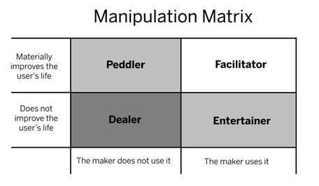

# 6. What Are You Going To Do With This?

6. WHAT ARE YOU GOING TO DO WITH THIS?

 

The Hook Model is designed to connect the user’s problem with the designer’s solution frequently enough to form a habit. It is a framework for building products that solve user needs through long-term engagement.

As users pass through cycles of The Hook Model, they learn to meet their needs with the habit-forming product. Effective hooks transition users from relying upon external triggers to cueing mental associations with internal triggers. Users move from states of low engagement to high engagement and from low preference to high preference.

You are now equipped to use the Hook Model to ask yourself these five fundamental questions for building effective hooks:

> > > > > > 1.   What do users really want? What pain is your product relieving? (Internal Trigger)

> > > > > > 2.   What brings users to your service? (External Trigger)

> > > > > > 3.   What is the simplest action users take in anticipation of reward, and how can you simplify your product to make this action easier? (Action)

> > > > > > 4.   Are users fulfilled by the reward, yet left wanting more? (Variable Reward)

> > > > > > 5.   What “bit of work” do users invest in your product? Does it load the next trigger and store value to improve the product with use? (Investment)

\*\*\*

The Morality of Manipulation

So now what? Now that you’re aware of the pattern for building habit-forming technology, how will you use this knowledge?

Perhaps while reading this book you asked yourself if the Hook Model is a recipe for manipulation. Maybe you felt a bit unsettled reading what seemed like a cookbook for mind control. If so, that is a very good thing.

The Hook Model is fundamentally about changing people’s behaviors; but the power to build persuasive products should be used with caution. Creating habits can be a force for good, but it can also be used for nefarious purposes. What responsibility do product makers have when creating user habits?

Let’s admit it, we are all in the persuasion business.[[cxiii]](../Text/index_split_024.html#filepos380184) Technologists build products meant to persuade people to do what we want them to do. We call these people “users” and even if we don’t say it aloud, we secretly wish every one of them would become fiendishly hooked to whatever we’re making. I’m guessing that’s likely why you started reading this book.

Users take their technologies with them to bed.[[cxiv]](../Text/index_split_024.html#filepos380530) When they wake up, they check for notifications, tweets, and updates, sometimes even before saying “Good morning” to their loved ones. Ian Bogost, the famed game creator and professor, calls the wave of habit-forming technologies the “cigarette of this century” and warns of their equally addictive and potentially destructive side-effects.[[cxv]](../Text/index_split_024.html#filepos380776)

You may be asking, “When is it wrong to manipulate users?”

Manipulation is an experience crafted to change behavior — we all know what it feels like. We’re uncomfortable when we sense someone is trying to make us do something we wouldn’t do otherwise, like when sitting through a car salesman’s spiel or hearing a timeshare presentation.

Yet, manipulation doesn’t always have a negative connotation. If it did, how could we explain the numerous multi-billion-dollar industries that rely heavily on users being willingly manipulated?

If manipulation is an experience crafted to change behavior, then Weight Watchers, one of the most successful mass-manipulation products in history, fits the definition.[[cxvi]](../Text/index_split_024.html#filepos381023) Weight Watchers customers’ decisions are programmed by the designer of the system. Yet, few question the morality of the business.

But what is the difference? Why is manipulating users through flashy advertising or addictive video games thought to be distasteful while a strict system of food rationing is considered laudable? While many people see Weight Watchers as an acceptable form of user manipulation, our moral compass has not caught up with what the latest technology now makes possible.

Ubiquitous access to the web, transferring greater amounts of personal data at faster speeds than ever before, has created a more potentially addictive world. According to famed Silicon Valley investor Paul Graham, we haven’t had time to develop societal “antibodies to addictive new things.”[[cxvii]](../Text/index_split_024.html#filepos381250) Graham places responsibility on the user: “Unless we want to be canaries in the coal mine of each new addiction — the people whose sad example becomes a lesson to future generations — we’ll have to figure out for ourselves what to avoid and how.”

But what of the people who make these manipulative experiences? After all, the corporations that unleash these habit-forming, and at times addictive, technologies are made up of human beings with a moral sense of right and wrong. They too have families and kids who are susceptible to manipulation. What shared responsibilities do we growth-hackers and behavior-designers have to our users, to future generations, and to ourselves?

With the increasing pervasiveness and persuasiveness of personal technology, some industry insiders have proposed creating an ethical code of conduct.[[cxviii]](../Text/index_split_024.html#filepos381463) Others believe differently: Chris Nodder, author of the book Evil by Design, writes “... it’s OK to deceive people if it’s in their best interests, or if they’ve given implicit consent to be deceived as part of a persuasive strategy.”[[cxix]](../Text/index_split_024.html#filepos381710)

I offer a simple decision support tool entrepreneurs, employees, and investors can use long before product is shipped or code is written. The Manipulation Matrix does not try to answer which businesses are moral or which will succeed, nor does it describe what can and can not become a habit-forming technology. The matrix seeks to help you answer not, “Can I hook my users?” but instead, “Should I attempt to?”

To use the Manipulation Matrix (figure 36), the maker needs to ask two questions. First, “Would I use the product myself?” and second, “Will the product help users materially improve their lives?”

Figure 36

Remember, this framework is for creating habit-forming products, not one-time use goods. Now, let’s explore the types of creators who represent the four quadrants of the Manipulation Matrix.

 

The Facilitator

When you create something that you would use and that you believe makes the user’s life better, you are facilitating a healthy habit. It is important to note that only you can decide if you would actually use the product or service, and what “materially improving the life of the user” really means in light of what you are creating.

If you find yourself squirming as you ask yourself these questions or needing to qualify or justify your answers, STOP! You failed. You have to actually want to use the product and believe it materially benefits your life as well as the lives of your users.

One exception is if you would have been a user in your younger years. For example, in the case of an education company, you may not need to use the service right now, but are certain you would have used it in your not-so-distant past. Note however that the further you are from your former self, the lower your odds of success.

In building a habit for a user other than yourself, you can not consider yourself a facilitator unless you have experienced the problem first-hand.

Jake Harriman grew up on a small farm in West Virginia. After graduating from the U.S. Naval Academy, Harriman served as an Infantry and Special Operations Platoon Commander in the Marine Corps. He was in Iraq during the 2003 invasion and led men into fierce gun battles with enemy combatants. Later, he assisted with disaster relief in Indonesia and Sri Lanka after the 2004 Asian tsunami.

Harriman says his encounter with extreme poverty abroad changed his life. After seven and a half years of active duty, Harriman realized that guns alone could not stop terrorists intent on harming Americans. “Desperate people commit desperate acts,” Harriman says. After his service, Harriman founded Nuru International, a social venture targeting extreme poverty by changing the habits of people living in rural areas.

However, exactly how Harriman would change the lives of the poorest people in the world was not clear to him until he decided to live among them. In Kenya, he discovered that basic practices of modern agriculture — like proper seed spacing — were still not used. But Harriman knew that simply teaching farmers new behaviors would not be enough.

Instead, by drawing upon his own rural upbringing and experience living with the farmers, Harriman uncovered the obstacles in their way. He soon learned that the lack of access to financing for high quality seeds and fertilizer kept farmers from utilizing yield-boosting techniques.

Today, Nuru is equipping farmers in Kenya and Ethiopia, helping them rise out of grinding poverty. It was only by becoming one of his users that Harriman could design solutions to meet their needs.[[cxx]](../Text/index_split_024.html#filepos381930)

Although it is a long way from Africa to Silicon Valley, the well-documented stories of the founders of Facebook and Twitter reveal they would likely see themselves as making products in the facilitator quadrant. Today, a new breed of companies is creating products to improve lives by creating healthy habits. Whether getting users to exercise more, creating a habit of journaling, or improving back posture, these companies are run by authentic entrepreneurs who desperately want their products to exist, firstly to satisfy their own needs.

But what if the usage of a well-intended product becomes extreme, even harmful? What about the users who go beyond forming habits, becoming full-fledged addicts?

First, it is important to recognize that the percentage of users who form a detrimental dependency is very small. Industry estimates for pathological users of even the most habit-forming technologies, such as slot machines gambling, are just one percent.[[cxxi]](../Text/index_split_024.html#filepos382116) Addiction tends to manifest in people with a particular psychological profile. However, simply brushing off the issue as too small to matter dismisses the very real problems caused by technology addiction.

For the first time, however, companies have access to data that could be used to flag which users are using their products too much. Whether companies choose to act on that data in a way that aids their users is, of course, a question of corporate responsibility. Companies building habit-forming technologies have a moral obligation — and perhaps someday a legal mandate — to inform and protect users who are forming unhealthy attachments to their products. It would behoove entrepreneurs building potentially addictive products to set guidelines for identifying and helping addicted users.

However, for the overwhelming majority of users, addiction to a product will never be a problem. Even though the world is becoming a potentially more addictive place, most people have the ability to self-regulate their behaviors.

The role of facilitator fulfills the moral obligation for entrepreneurs building a product they will use, and which they believe materially improves the lives of others. As long as they have procedures in place to assist those who form unhealthy addictions, the designer can act with a clean conscience. To take liberties with Mahatma Gandhi’s famous quote, facilitators “build the change they want to see in the world.”

The Peddler

Heady altruistic ambitions can at times outpace reality. Too often, designers of manipulative technology have a strong motivation to improve the lives of their users, but when pressed, they admit they would not actually use their own creations. Their holier-than-thou products often try to “gamify” some task no one actually wants to do by inserting run-of-the-mill incentives such as badges or points that don’t actually hold value for their users.

Fitness apps, charity websites, and products that claim to suddenly turn hard work into fun often fall in this quadrant. But possibly the most common example of peddlers is in advertising.

Countless companies convince themselves they’re making ad campaigns users will love. They expect their videos to go viral and their branded apps to be used daily. Their so-called “reality distortion fields” keep them from asking the critical question, “Would I actually find this useful?”[[cxxii]](../Text/index_split_024.html#filepos382442) The answer to this uncomfortable question is nearly always “No,” so they twist their thinking until they can imagine a user they believe might find the ad valuable.

Materially improving users’ lives is a tall order, and attempting to create a persuasive technology that you do not use yourself is incredibly difficult. This puts designers at a heavy disadvantage because of their disconnect with their products and users. There’s nothing immoral about peddling; in fact, many companies working on solutions for others do so out of purely altruistic reasons. It’s just that the odds of successfully designing products for a customer you don’t know extremely well are depressingly low. Peddlers tend to lack the empathy and insights needed to create something users actually want. Often the peddler's project results in a time-wasting failure because the designers did not fully understand their users. As a result, no one finds the product useful.

The Entertainer

Sometimes product-makers just want to have fun. If creators of a potentially addictive technology make something that they use but can’t in good conscience claim improves users’ lives, they’re making entertainment.

Entertainment is art and is important for its own sake. Art provides joy, helps us see the world differently, and connects us with the human condition. These are all important and age-old pursuits. Entertainment, however, has particular attributes of which the entrepreneur, employee, and investor should be aware when using the Manipulation Matrix.

Art is often fleeting; products that form habits around entertainment tend to fade quickly from users’ lives. A hit song, repeated over and over again in the mind, becomes nostalgia after it is replaced by the next chart-topper. A book like this one is read and thought about for a while until the next interesting piece of brain candy comes along. As we learned in the chapter on variable rewards, games like FarmVille and Angry Birds engross users, but then are relegated to the gaming dustbin along with other hyper-addictive has-beens such as Pac Man and Mario Bros.

Entertainment is a hits-driven business because the brain reacts to stimulus by wanting more and more of it, ever hungry for continuous novelty. Building an enterprise on ephemeral desires is akin to running on an incessantly rolling treadmill: You have to keep up with the constantly changing demands of your users. In this quadrant, the sustainable business is not purely the game, the song, or the book — profit comes from an effective distribution system for getting those goods to market while they’re still hot, and at the same time keeping the pipeline full of fresh releases to feed an eager audience.

The Dealer

Creating a product that the designer does not believe improves users’ lives and that he himself would not use is called exploitation. In the absence of these two criteria, presumably the only reason the designer is hooking users is to make a buck. Certainly there is money to be made addicting users to behaviors that do little more than extract cash; and where there is cash, there will be someone willing to take it.

The question is: Is that someone you? Casinos and drug dealers offer users a good time, but when the addiction takes hold, the fun stops.

In a satirical take on Zynga’s FarmVille franchise, Ian Bogost created Cow Clicker, a Facebook app where users did nothing but incessantly click on virtual cows to hear a satisfying “moo.”[[cxxiii]](../Text/index_split_024.html#filepos382762) Bogost intended to lampoon FarmVille by blatantly implementing the same game mechanics and viral hacks he thought would be laughably obvious to users. But after the app’s usage exploded and some people became frighteningly obsessed with the game, Bogost shut it down, bringing on what he called “The Cowpocalypse.”[[cxxiv]](../Text/index_split_024.html#filepos383044)

Bogost rightfully compared addictive technology to cigarettes. Certainly, the incessant need for a smoke in what was once a majority of the adult U.S. population has been replaced by a nearly equal compulsion to constantly check our devices. But unlike the addiction to nicotine, new technologies offer an opportunity to dramatically improve users’ lives. Like all technologies, recent advances in the habit-forming potential of digital innovation have both positive and negative effects.

But if the innovator has a clear conscience that the product materially improves people’s lives — first among them, the designer’s — then the only path is to push forward. With the exception of the addicted one percent, users bear ultimate responsibility for their actions.

However, as the march of technology makes the world a potentially more addictive place, innovators need to consider their role. It will be years, perhaps generations, before society develops the mental antibodies to control new habits; in the meantime, many of these behaviors may develop harmful side-effects. For now, users must learn to assess these yet-unknown consequences for themselves, while creators will have to live with the moral repercussions of how they spend their professional lives.

My hope is that the Manipulation Matrix helps innovators consider the implications of the products they create. Perhaps after reading this book, you’ll start a new business. Maybe you’ll join an existing company with a mission to which you are committed. Or, perhaps you will decide it is time to quit your job because you’ve come to realize it no longer points in the same direction as your moral compass.

\*\*\*

Remember and Share

- To help designers of habit-forming technology assess the morality behind how they manipulate users, it is helpful to determine which of the four categories their work fits into. Are you a facilitator, peddler, entertainer, or dealer?

- Facilitators use their own product and believe it can materially improve people’s lives. They have the highest chance of success because they most closely understand the needs of their users.

- Peddlers believe their product can materially improve people’s lives, but do not use it themselves. They must beware of the hubris and inauthenticity that comes from building solutions for people they do not understand.

- Entertainers use their product, but do not believe it can improve people’s lives. They can be successful, but without making the lives of others better in some way, the entertainer’s products often lack staying power.

- Dealers neither use the product nor believe it can improve people’s lives. They have the lowest chance of finding long-term success and often find themselves in morally precarious positions.

\*\*\*

Do This Now

- Take a minute to consider where you fall on the Manipulation Matrix. Do you use your own product or service? Does it influence positive or negative behaviors? How does it make you feel? Ask yourself if you are proud of the way you are influencing the behavior of others.

[*OceanofPDF.com*](https://oceanofpdf.com)
